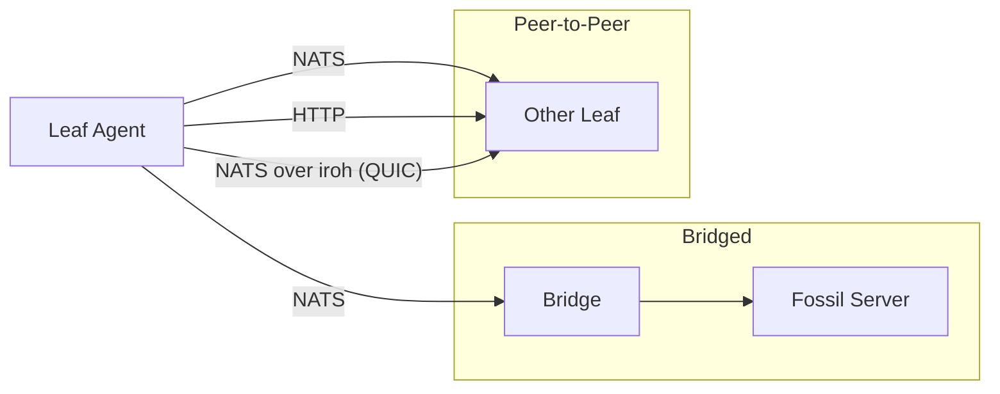

# EdgeSync

Replace Fossil's HTTP sync with NATS messaging or direct peer-to-peer sync. Leaf agents can act as both sync clients and servers — a stock `fossil clone`/`fossil sync` can talk to them directly.

## Architecture



**Four sync modes:**
1. **Leaf → Bridge → Fossil Server** — Original mode. Bridge translates NATS to HTTP `/xfer`.
2. **Leaf → Leaf (NATS)** — Peer-to-peer via ServeNATS. No bridge or server needed.
3. **Leaf → Leaf (HTTP)** — Peer-to-peer via ServeHTTP. Stock `fossil clone`/`fossil sync` works.
4. **Leaf → Leaf (iroh)** — Peer-to-peer over QUIC with NAT traversal. Each agent runs an embedded NATS server; leaf node connections tunnel over iroh. Enables presence and messaging without central infrastructure.

## Quick Start

```bash
# One command: install hooks + build + test
make setup

# Run the leaf agent
bin/leaf --repo my.fossil --nats nats://localhost:4222 --serve-http :8080

# Run the edgesync CLI
bin/edgesync repo info
```

### Dual VCS Note

This repo is tracked by both Git and Fossil. Go's VCS stamping gets confused by this, so **all `go build` commands need `-buildvcs=false`**. The Makefile handles this automatically. If you run `go build` directly:

```bash
# Either pass the flag every time:
go build -buildvcs=false ./cmd/edgesync/

# Or set it once per shell session:
export GOFLAGS="-buildvcs=false"
go build ./cmd/edgesync/   # works without the flag now
```

If you use [direnv](https://direnv.net/), the included `.envrc` sets this for you automatically.

### Telemetry (Optional)

Traces, metrics, and structured logs via OpenTelemetry. Zero overhead when disabled — the leaf agent logs whether telemetry is active at startup.

```bash
# With Doppler (manages OTel secrets):
doppler run -- bin/leaf --repo my.fossil --nats nats://localhost:4222

# Or set the endpoint directly:
OTEL_EXPORTER_OTLP_ENDPOINT=localhost:4318 bin/leaf --repo my.fossil --nats nats://localhost:4222
```

## Project Layout

```
cmd/edgesync/          Unified CLI binary (50 subcommands)

go-libfossil/          Core library — Go port of Fossil internals
  annotate/            Line-level blame/annotate
  bisect/              Binary search for regressions
  blob/                Blob compression (Fossil's 4-byte prefix + zlib)
  content/             Artifact storage and expansion (delta chains)
  db/                  SQLite adapter (3 drivers via build tags)
  deck/                Manifest/control-artifact parsing
  delta/               Fossil delta codec (ported from delta.c)
  hash/                SHA1/SHA3-256 content addressing
  manifest/            Checkin, file listing, timeline
  merge/               3-way merge with swappable strategies
  path/                Checkout path resolution
  repo/                Fossil repo DB operations (create, open, verify)
  simio/               Simulation I/O abstractions (Clock, Rand, Env)
  stash/               Working-tree stash save/restore
  sync/                Sync engine: client (Sync, Clone), server (HandleSync,
                         ServeHTTP), transport (HTTP, NATS, mock)
  tag/                 Tag read/write on artifacts
  testutil/            Shared test helpers
  undo/                Undo/redo state tracking
  xfer/                Xfer card protocol encoder/decoder

leaf/                  Leaf agent module
  agent/               Agent logic, NATS transport, ServeNATS, ServeP2P stub
  cmd/leaf/            Standalone leaf daemon binary

bridge/                Bridge module
  bridge/              Bridge logic (NATS <-> HTTP /xfer translation)
  cmd/bridge/          Standalone bridge daemon binary

dst/                   Deterministic simulation testing
                         SimNetwork (bridge mode), PeerNetwork (leaf-to-leaf)
sim/                   Integration simulation testing
                         Real NATS + Fossil + fault proxy + serve tests
  cmd/soak/            Continuous soak test runner

docs/                  Documentation
  dev/specs/           Design specifications
  dev/plans/           Implementation plans
```

## Go Modules

| Module | Path | Purpose |
|--------|------|---------|
| `github.com/dmestas/edgesync` | `.` | Root: CLI, sim/, soak runner |
| `github.com/dmestas/edgesync/go-libfossil` | `go-libfossil/` | Core library |
| `github.com/dmestas/edgesync/leaf` | `leaf/` | Leaf agent |
| `github.com/dmestas/edgesync/bridge` | `bridge/` | Bridge |
| `github.com/dmestas/edgesync/dst` | `dst/` | Deterministic sim tests |

## SQLite Drivers

```bash
go build ./...                            # modernc (default, pure Go)
go build -tags ncruces ./...              # ncruces (WASM-based)
CGO_ENABLED=1 go build -tags mattn ./...  # mattn (CGo, best performance)
```

## Testing

```bash
make test              # CI tests + sim serve (~15s)
make dst               # DST: 8 seeds, normal (~2s)
make dst-full          # DST: 16 seeds x 3 levels (~40s)
make sim               # Integration sim: 1 seed (requires fossil)
make sim-full          # Integration sim: 16 seeds x 3 severities
make drivers           # Test all 3 SQLite drivers
```

## Dependencies

- `modernc.org/sqlite` — Pure Go SQLite (default driver)
- `github.com/nats-io/nats.go` — NATS + JetStream client
- `github.com/alecthomas/kong` — CLI framework
- `github.com/hexops/gotextdiff` — Unified diff output

## Reference

- [Fossil sync protocol](https://fossil-scm.org/home/doc/tip/www/sync.wiki)
- [Fossil delta format](https://fossil-scm.org/home/doc/tip/www/delta_format.wiki)
- [Fossil password authentication](https://fossil-scm.org/home/doc/tip/www/password.wiki)
