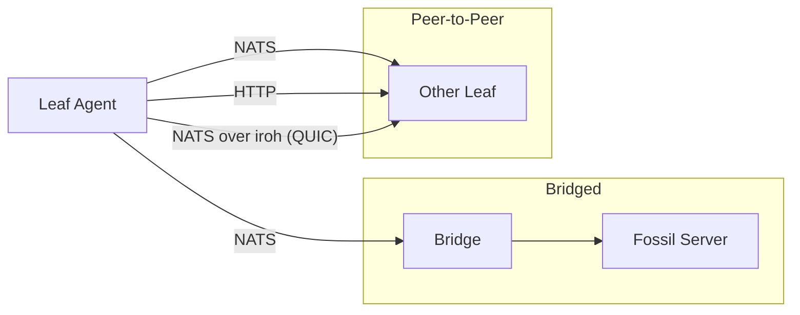

# EdgeSync

[](https://github.com/danmestas/EdgeSync/actions/workflows/ci.yml)
[](https://pkg.go.dev/github.com/danmestas/EdgeSync)
[](LICENSE)
[](https://goreportcard.com/report/github.com/danmestas/EdgeSync)

Sync engine for distributed teams that want code-and-data replication without a central server. Each peer carries the full repository, syncs over [NATS](https://nats.io) messaging or QUIC tunnels (via [iroh](https://www.iroh.computer/)), and stays compatible with the [Fossil](https://fossil-scm.org/) version-control protocol — so a stock `fossil clone` or `fossil sync` still works against any leaf agent.

## Why EdgeSync

Centralized sync (Git over HTTPS, S3, Postgres replication) breaks down when peers are intermittently connected, NAT-stuck, or want eventual-consistency replication of structured state alongside code. EdgeSync solves three problems together:

- **Real-time over messaging.** Use NATS subjects for low-latency change announcements; sync hops are sub-second on a healthy connection.
- **No central server required.** Two leaf agents over iroh form a peer-to-peer mesh that traverses NAT without VPN.
- **Fossil-compatible wire format.** Existing Fossil tooling continues to work; EdgeSync is a faster transport, not a replacement DAG.

If your team is using Git + an HTTP server and that's working well, you don't need EdgeSync. If you're building offline-first agents, multi-tenant collaboration tools, or anything where peer-to-peer beats request-response, this is for you.

## Status

**Pre-1.0 (v0.0.x).** APIs are stable in spirit but may change in patch releases until 1.0. The leaf agent and sync engine run in a [reference production deployment](docs/site/content/docs/deployment.md) and pass deterministic-simulation, integration, and interop test suites against the real Fossil binary on every commit. Suitable for evaluation and self-hosted use; not yet under formal version policy.

## Architecture



**Four sync modes:**
1. **Leaf → Bridge → Fossil Server** — Original mode. Bridge translates NATS to HTTP `/xfer`.
2. **Leaf → Leaf (NATS)** — Peer-to-peer via ServeNATS. No bridge or server needed.
3. **Leaf → Leaf (HTTP)** — Peer-to-peer via ServeHTTP. Stock `fossil clone`/`fossil sync` works.
4. **Leaf → Leaf (iroh)** — Peer-to-peer over QUIC with NAT traversal. Each agent runs an embedded NATS server; leaf node connections tunnel over iroh. Enables presence and messaging without central infrastructure.

## Prerequisites

- **Go 1.26+** — required to build all binaries
- **NATS server** — for sync modes 1, 2, 4 (skip if using mode 3 over plain HTTP). Install via `brew install nats-server` or [nats-io/nats-server releases](https://github.com/nats-io/nats-server/releases)
- **Fossil binary** *(optional)* — needed only for interop tests and to create demo repos. Install from [fossil-scm.org/downloads](https://fossil-scm.org/home/uv/download.html)
- **direnv** *(optional)* — if installed, the included `.envrc` sets `GOFLAGS=-buildvcs=false` automatically (see Dual VCS Note below)

## Quick Start

```bash
# Clone, install hooks, build all binaries, run tests
git clone https://github.com/danmestas/EdgeSync
cd EdgeSync
make setup

# Create a demo Fossil repo (or use any existing .fossil file)
fossil new demo.fossil

# Start NATS in another terminal
nats-server &

# Run the leaf agent
bin/leaf --repo demo.fossil --nats nats://localhost:4222 --serve-http :8080

# Inspect repository state
bin/edgesync repo info -R demo.fossil
```

A stock `fossil` client can now clone from the leaf agent over HTTP:

```bash
fossil clone http://localhost:8080 /tmp/from-leaf.fossil
```

## Use as a Go library

EdgeSync is a multi-module repo. Each module is independently importable:

```bash
# Sync engine + repo internals (most common)
go get github.com/danmestas/libfossil

# Leaf agent (NATS + HTTP server, mesh, notify)
go get github.com/danmestas/EdgeSync/leaf

# Bridge (NATS ↔ Fossil HTTP /xfer translator)
go get github.com/danmestas/EdgeSync/bridge

# Embeddable Kong CLI commands
go get github.com/danmestas/EdgeSync/cli
```

API documentation: [pkg.go.dev/github.com/danmestas/EdgeSync](https://pkg.go.dev/github.com/danmestas/EdgeSync). Each module has a `README.md` with the public API surface and example usage.

### Dual VCS Note

This repo is tracked by both Git and Fossil. Go's VCS stamping gets confused by this, so **all `go build` commands need `-buildvcs=false`**. The Makefile handles this automatically. If you run `go build` directly:

```bash
# Either pass the flag every time:
go build -buildvcs=false ./cmd/edgesync/

# Or set it once per shell session:
export GOFLAGS="-buildvcs=false"
go build ./cmd/edgesync/   # works without the flag now
```

If you use [direnv](https://direnv.net/), the included `.envrc` sets this for you automatically.

### Telemetry (Optional)

Traces, metrics, and structured logs via OpenTelemetry. Zero overhead when disabled — the leaf agent logs whether telemetry is active at startup.

```bash
# With Doppler (manages OTel secrets):
doppler run -- bin/leaf --repo my.fossil --nats nats://localhost:4222

# Or set the endpoint directly:
OTEL_EXPORTER_OTLP_ENDPOINT=localhost:4318 bin/leaf --repo my.fossil --nats nats://localhost:4222
```

## Deep Dive

Architecture decisions and protocol details live in [`docs/architecture/`](docs/architecture/):

- [`core-library.md`](docs/architecture/core-library.md) — libfossil package layout, blob format, xfer wire format, SQLite drivers
- [`sync-protocol.md`](docs/architecture/sync-protocol.md) — xfer card protocol, client/server flow, clone, UV, config sync, private artifacts
- [`agent-deployment.md`](docs/architecture/agent-deployment.md) — leaf agent, bridge, Docker, WASM targets, observability
- [`checkout-merge.md`](docs/architecture/checkout-merge.md) — checkout/checkin, merge strategies, fork prevention, autosync, ci-lock
- [`repo-operations.md`](docs/architecture/repo-operations.md) — CLI, tags, FTS, verify/rebuild, auth, shun/purge
- [`testing-strategy.md`](docs/architecture/testing-strategy.md) — test tiers, DST, sim, interop, BUGGIFY
- [`notify-messaging.md`](docs/architecture/notify-messaging.md) — bidirectional messaging: data model, dual delivery, CLI, planned phases
- [`wasm-targets.md`](docs/architecture/wasm-targets.md) — WASI and browser builds

## Project Layout

```
cmd/edgesync/          Unified CLI binary (50 subcommands)
cli/                   Embeddable Kong commands (importable as a Go module)

leaf/                  Leaf agent module
  agent/               Agent logic, NATS transport, ServeNATS, ServeP2P stub
  cmd/leaf/            Standalone leaf daemon binary
  cmd/wasm/            Browser-WASM build target

bridge/                Bridge module
  bridge/              Bridge logic (NATS <-> HTTP /xfer translation)
  cmd/bridge/          Standalone bridge daemon binary

dst/                   Deterministic simulation testing
sim/                   Integration simulation (real NATS + Fossil + fault proxy)
  cmd/soak/            Continuous soak test runner

docs/                  Documentation
  architecture/        Design specs and protocol references
  site/                Hugo site (deployed to docs.example.com)
```

The core sync engine and repo internals live in the separate [`libfossil`](https://github.com/danmestas/libfossil) repo and are imported as a public Go module.

## Go Modules

| Module | Path | Purpose |
|--------|------|---------|
| `github.com/danmestas/EdgeSync` | `.` | Root: CLI, sim/, soak runner |
| `github.com/danmestas/EdgeSync/leaf` | `leaf/` | Leaf agent |
| `github.com/danmestas/EdgeSync/bridge` | `bridge/` | Bridge |
| `github.com/danmestas/EdgeSync/cli` | `cli/` | Embeddable Kong commands |
| `github.com/danmestas/EdgeSync/dst` | `dst/` | Deterministic sim tests |
| `github.com/danmestas/libfossil` | external | Core library (separate repo) |

## SQLite Drivers

```bash
go build ./...                            # modernc (default, pure Go)
go build -tags ncruces ./...              # ncruces (WASM-based)
CGO_ENABLED=1 go build -tags mattn ./...  # mattn (CGo, best performance)
```

## Testing

```bash
make test              # CI tests + sim serve (~15s)
make dst               # DST: 8 seeds, normal (~2s)
make dst-full          # DST: 16 seeds x 3 levels (~40s)
make sim               # Integration sim: 1 seed (requires fossil)
make sim-full          # Integration sim: 16 seeds x 3 severities
make drivers           # Test all 3 SQLite drivers
```

## Dependencies

- `modernc.org/sqlite` — Pure Go SQLite (default driver)
- `github.com/nats-io/nats.go` — NATS + JetStream client
- `github.com/alecthomas/kong` — CLI framework
- `github.com/hexops/gotextdiff` — Unified diff output

## License

[Apache License 2.0](LICENSE)

## Reference

- [Fossil sync protocol](https://fossil-scm.org/home/doc/tip/www/sync.wiki)
- [Fossil delta format](https://fossil-scm.org/home/doc/tip/www/delta_format.wiki)
- [Fossil password authentication](https://fossil-scm.org/home/doc/tip/www/password.wiki)
- [NATS messaging](https://nats.io)
- [iroh QUIC mesh](https://www.iroh.computer/)
