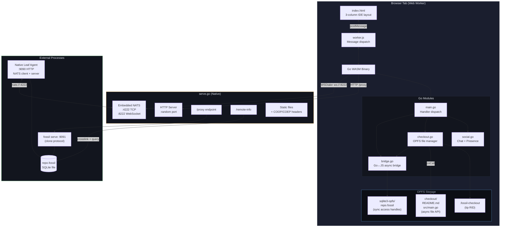
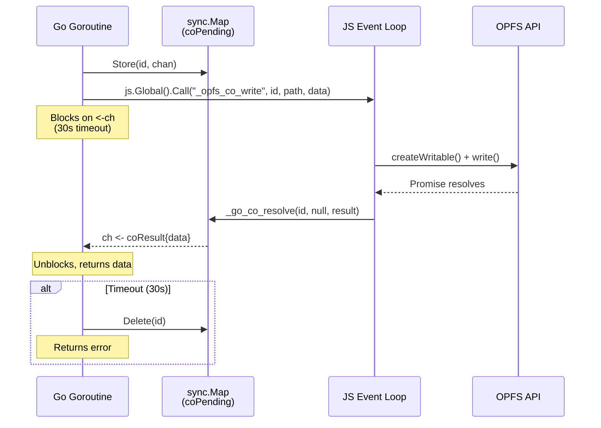
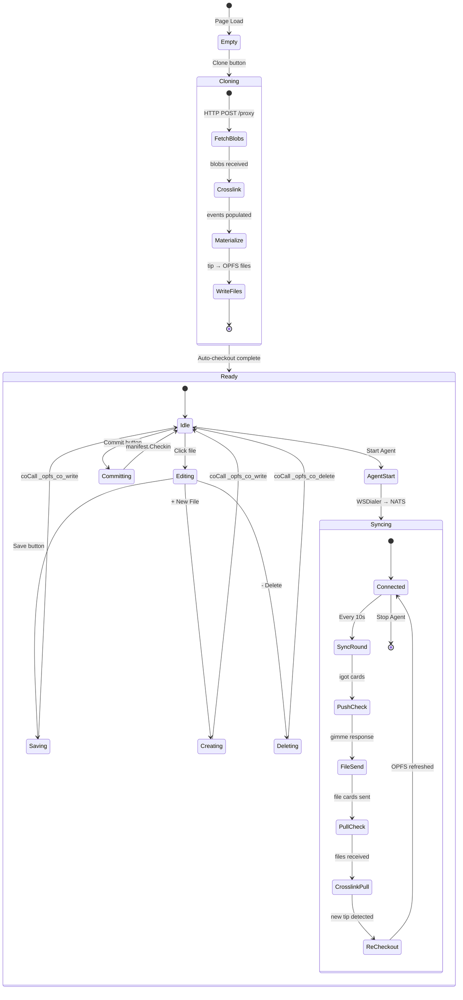
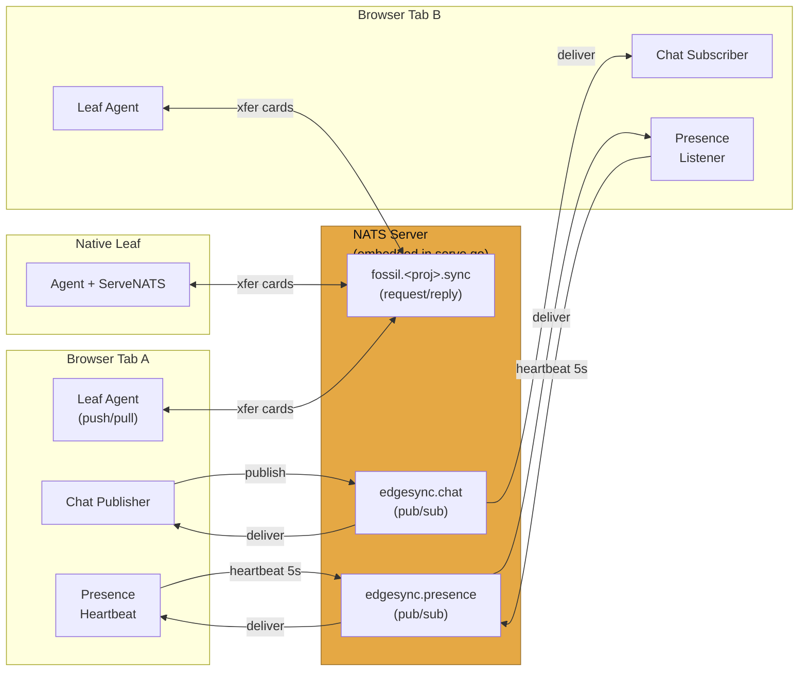
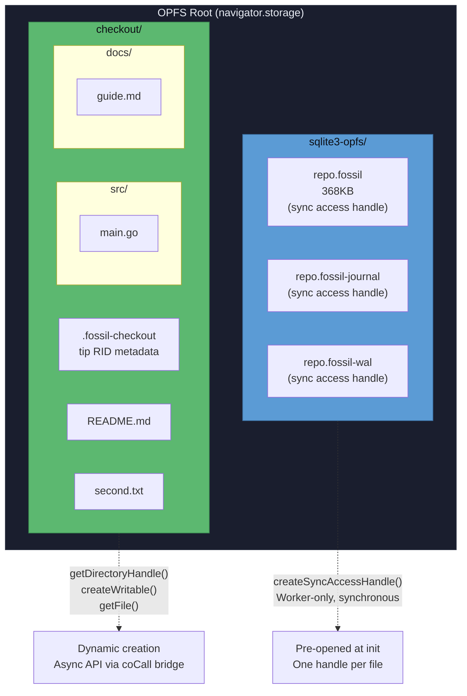
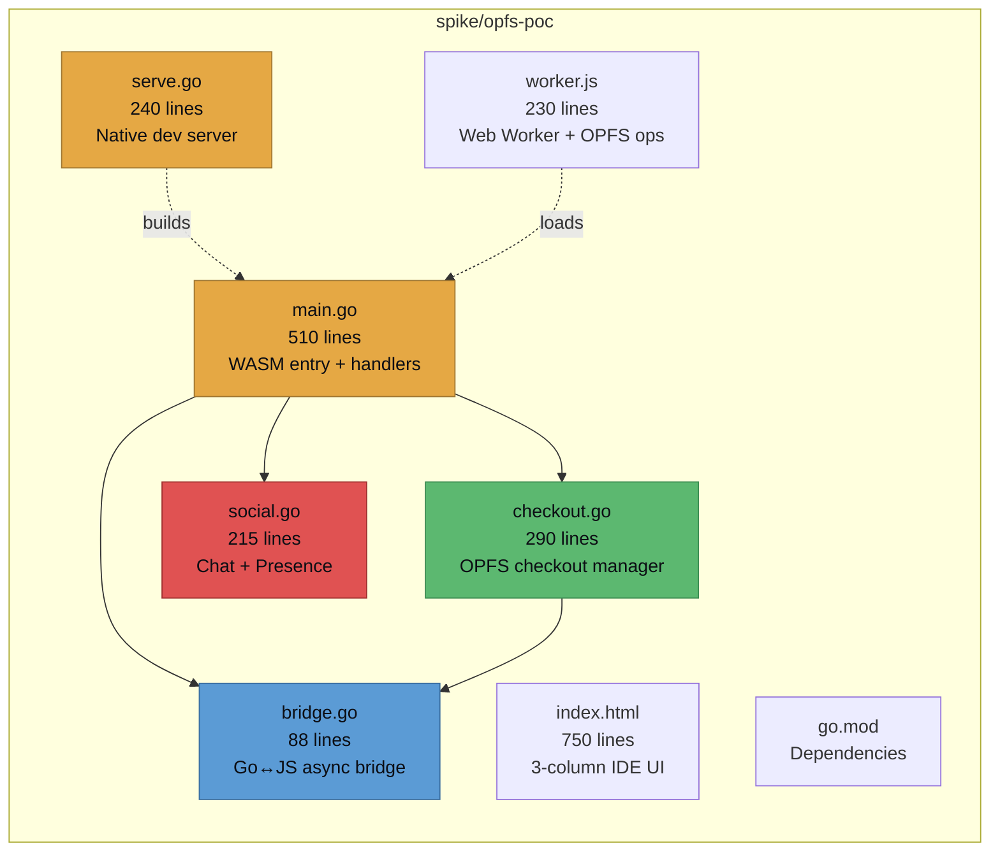

# EdgeSync Browser Playground — Architecture Diagrams

## System Architecture

## Go↔JS Async Bridge

## Clone → Checkout → Sync Flow

## NATS Message Routing

## OPFS Storage Layout

## File Structure

